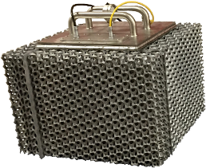

# RuggedPOD

RuggedPOD is a microdatacenter project designed under the [Open Compute Project](http://www.opencompute.org/)
license. The project aims to create the most energy efficient datacenter solution
in the world, through a building block approach without the need of expensive
upfront infrastructure.

The solution is designed to run outdoor, produced everywhere around the world
through communities of hackers. It can be used for edge computing, datacenter,
low cost Telecom solutions, SMB or corporate customers. Use cases are still under
heavy investigation and raised by our daily expanding community as this
breakthrough technology is able to get the cloud back outside !
